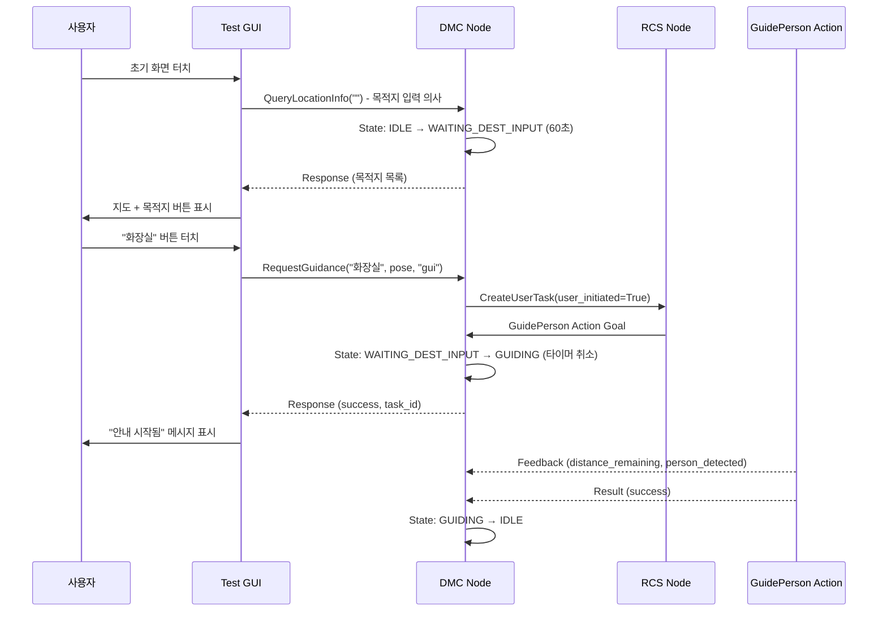

# GUI <-> DMC 통신 정리 문서

> 작성자: 김우영  
> 용도: Test GUI와 DMC 간의 Service 인터페이스 정리  
> 대상: 도서관 로봇 Dobby  
> 작성일: 2025-01-27

---

## 📦 인터페이스 요약

| From | To   | Protocol | Interface 항목              | 메시지 형식                                  |
|------|------|----------|----------------------------|----------------------------------------------|
| GUI  | DMC  | Service  | 위치 정보 조회              | `dobby1/admin/query_location_info`          |
| GUI  | DMC  | Service  | 길안내 요청                 | `dobby1/admin/request_guidance`             |
| DMC  | GUI  | Topic    | 로봇 상태 발행              | `dobby1/status/robot_state`                 |

---

## 🔧 Service 정의

### 1. 위치 정보 조회 – `QueryLocationInfo.srv`

**용도**: GUI 화면에서 터치한 위치의 좌표와 상세 정보를 조회

**Service Name**: `dobby1/admin/query_location_info`

**Message Definition**:
```srv
# Request
string location_name  # 조회할 위치 이름 (예: "화장실", "카페", "출입구")

---

# Response
bool found                          # 위치를 찾았는지 여부
geometry_msgs/Pose2D pose           # 위치 좌표 (x, y, theta)
string description                  # 위치 설명 (한국어)
string[] aliases                    # 별칭 목록 (예: ["화장실", "toilet", "restroom"])
```

**사용 시나리오 (v4.0)**:
1. GUI 초기 화면 표시 ("길안내 시 터치해주세요")
2. 사용자가 화면 터치
3. GUI가 `QueryLocationInfo` 서비스 호출 (목적지 입력 의사 표현 + 목록 요청)
4. **DMC 상태 전환**: IDLE/ROAMING → **WAITING_DEST_INPUT(11)** (60초 타이머 시작)
5. DMC는 `library_locations.yaml`에서 목적지 목록 검색
6. 좌표, 설명, 별칭을 Response로 반환
7. GUI는 지도 화면 + 목적지 버튼들 표시 (예: 화장실, 카페, 출입구)
8. 사용자가 특정 목적지 버튼 터치 (예: "화장실")
9. **60초 내 RequestGuidance 미호출 시** → 타이머 만료 → 이전 상태로 복귀

**DMC 상태 변화**:
```
IDLE/ROAMING → QueryLocationInfo 호출 → WAITING_DEST_INPUT (60초 타이머)
                                      ↓
                         60초 내 RequestGuidance 호출
                                      ↓
                         CreateUserTask → RCS
                                      ↓
                         GuidePerson Action Goal
                                      ↓
                                  GUIDING
                                      
                              60초 타임아웃 또는 취소
                                      ↓
                              이전 상태로 복귀 (IDLE/ROAMING)
```

**예시 호출**:
```python
# Request (초기 목록 요청)
location_name: ""  # 빈 문자열 = 전체 목록 요청

# Response
found: True
locations: [
  {
    name: "화장실",
    pose: {x: 10.5, y: 3.2, theta: 1.57},
    description: "1층 화장실 (남/여)",
    aliases: ["화장실", "toilet", "restroom"]
  },
  {
    name: "카페",
    pose: {x: 5.0, y: 8.0, theta: 0.0},
    description: "1층 카페테리아",
    aliases: ["카페", "cafe", "커피"]
  },
  ...
]
```

---

### 2. 길안내 요청 – `RequestGuidance.srv`

**용도**: 사용자가 목적지를 확정하여 길안내를 요청

**Service Name**: `dobby1/admin/request_guidance`

**Message Definition**:
```srv
# Request
string destination_name              # 목적지 이름 (예: "화장실")
geometry_msgs/Pose2D dest_pose       # 목적지 좌표 (QueryLocationInfo로 받은 값)
string request_source                # 요청 출처: "gui" 또는 "voice"

---

# Response
bool success                         # 요청 성공 여부
string task_id                       # 생성된 작업 ID (예: "guidance_20250127_143022")
string message                       # 상태 메시지 (예: "길안내를 시작합니다", "로봇이 사용 중입니다")
```

**사용 시나리오 (v4.0)**:
1. 사용자가 GUI에서 목적지 버튼 터치 (예: "화장실")
2. GUI가 `RequestGuidance` 서비스 호출 (destination_name, dest_pose, "gui" 전달)
3. **DMC 내부 처리**:
   - 배터리 체크 (≥40%)
   - 60초 타이머 취소 (WAITING_DEST_INPUT 상태에서)
   - RCS에 CreateUserTask Service 호출 (user_initiated=True)
   - RCS로부터 task_id 수신
4. **RCS**: GuidePerson Action 호출 (goal.user_initiated=True)
5. **DMC 상태 전환**: WAITING_DEST_INPUT(11) → **GUIDING(6)**
6. DMC가 Action Goal 수락 및 길안내 시작
7. Response로 task_id와 성공 메시지 반환
8. GUI는 "안내 시작됨" 상태 표시

**전체 흐름**:
```
GUI → RequestGuidance → DMC
                         ↓
                    배터리 체크
                         ↓
              DMC → CreateUserTask → RCS
                         ↓
              RCS → GuidePerson Action → DMC
                         ↓
              DMC: WAITING_DEST_INPUT → GUIDING (타이머 취소)
```

**예시 호출**:
```python
# Request
destination_name: "화장실"
dest_pose:
  x: 10.5
  y: 3.2
  theta: 1.57
request_source: "gui"

# Response
success: True
task_id: "guidance_20250127_143022"
message: "화장실로 길안내를 시작합니다"
```

**에러 케이스**:
```python
# Case 1: 배터리 부족
Response:
  success: False
  task_id: ""
  message: "배터리가 부족하여 길안내를 시작할 수 없습니다 (현재: 35%, 필요: 40%)"

# Case 2: RCS 작업 생성 실패
Response:
  success: False
  task_id: ""
  message: "작업 생성에 실패했습니다"
```

---

## 📡 Topic 구독

### 1. 로봇 상태 – `DobbyState.msg`

GUI는 로봇의 현재 상태를 실시간으로 모니터링하기 위해 구독합니다.

**Topic Name**: `dobby1/status/robot_state`

**Message Definition**: `javis_interfaces/msg/DobbyState.msg` 참조

**주요 상태**:
- `IDLE(2)`: 대기 중 (GUI 요청 수신 가능)
- `LISTENING(10)`: 음성 명령 대기 중
- `WAITING_DEST_INPUT(11)`: GUI/VRC에서 목적지 입력 대기 중
- `GUIDING(6)`: 길안내 수행 중
  - Sub State: `SCAN_USER(110)`, `GUIDING_TO_DEST(111)`, `FIND_USER(112)`

**GUI 사용 예시**:
```python
def robot_state_callback(self, msg):
    if msg.main_state == 11:  # WAITING_DEST_INPUT
        self.enable_location_selection()  # 위치 선택 활성화
    elif msg.main_state == 6:  # GUIDING
        self.show_guiding_progress()  # 안내 진행 상태 표시
```

---

## 🔄 전체 Workflow

### GUI 기반 길안내 흐름



---

## ⚙️ 네임스페이스 설정

- **로봇 네임스페이스**: `dobby1` (멀티 로봇 환경 대비)
- **Service 네임스페이스**: `admin` (관리자 인터페이스)
  - `dobby1/admin/query_location_info`
  - `dobby1/admin/request_guidance`
- **Topic 네임스페이스**: `status` (상태 정보)
  - `dobby1/status/robot_state`

---

## 📝 구현 참고사항

### DMC 측 구현 필요사항

1. **Service Server 등록**:
   ```python
   self.query_location_srv = self.create_service(
       QueryLocationInfo,
       'admin/query_location_info',
       self._handle_query_location
   )
   
   self.request_guidance_srv = self.create_service(
       RequestGuidance,
       'admin/request_guidance',
       self._handle_request_guidance
   )
   ```

2. **library_locations.yaml 로딩**:
   ```python
   def _load_library_locations(self):
       yaml_path = os.path.join(
           get_package_share_directory('javis_dmc'),
           'config',
           'library_locations.yaml'
       )
       with open(yaml_path, 'r', encoding='utf-8') as f:
           self.library_locations = yaml.safe_load(f)
   ```

3. **상태 전환 로직**:
   ```python
   def _handle_request_guidance(self, request, response):
       # QueryLocationInfo(GUI) 또는 wakeWord(VRC)로 이미 진입한 상태 확인
       if self.state_manager.get_main_state() not in [MainState.WAITING_DEST_INPUT, MainState.LISTENING]:
           response.success = False
           response.message = "로봇이 현재 다른 작업을 수행 중입니다"
           return response
       
       # 타이머 취소
       if self.state_manager.get_main_state() == MainState.WAITING_DEST_INPUT:
           self._cancel_dest_input_timer()
       elif self.state_manager.get_main_state() == MainState.LISTENING:
           self._cancel_listening_timer()
       
       # RCS에 CreateUserTask 호출
       task_response = self.create_user_task_client.call(CreateUserTask.Request(
           task_type='guide_person',
           destination_name=request.destination_name,
           dest_pose=request.dest_pose,
           user_initiated=True
       ))
       
       # RCS가 GuidePerson Action Goal 전송 → _execute_guide_person()에서 GUIDING 전환
       
       response.success = True
       response.task_id = task_response.task_id
       response.message = f"{request.destination_name}로 길안내를 시작합니다"
       return response
   ```

### GUI 측 구현 필요사항

1. **Service Client 생성**:
   ```python
   self.query_location_client = self.create_client(
       QueryLocationInfo,
       '/dobby1/admin/query_location_info'
   )
   
   self.request_guidance_client = self.create_client(
       RequestGuidance,
       '/dobby1/admin/request_guidance'
   )
   ```

2. **지도 터치 이벤트 처리**:
   ```python
   def on_map_clicked(self, location_name):
       request = QueryLocationInfo.Request()
       request.location_name = location_name
       
       future = self.query_location_client.call_async(request)
       future.add_done_callback(self.show_confirmation_popup)
   ```

3. **확인 버튼 처리**:
   ```python
   def on_confirm_guidance(self, location_name, pose):
       request = RequestGuidance.Request()
       request.destination_name = location_name
       request.dest_pose = pose
       request.request_source = "gui"
       
       future = self.request_guidance_client.call_async(request)
       future.add_done_callback(self.handle_guidance_response)
   ```

---

## 🧪 테스트 체크리스트

- [ ] QueryLocationInfo: 유효한 위치 이름 조회 성공
- [ ] QueryLocationInfo: 잘못된 위치 이름 → `found=False` 반환
- [ ] RequestGuidance: IDLE/WAITING_DEST_INPUT 상태에서 요청 성공
- [ ] RequestGuidance: GUIDING 상태에서 요청 → `success=False` 반환
- [ ] RequestGuidance: task_id 생성 및 유일성 검증
- [ ] GUI 지도 터치 → 확인 팝업 → 안내 시작 → 상태 업데이트 전체 흐름
- [ ] library_locations.yaml의 모든 위치에 대한 조회 테스트

---

## 📚 참고 문서

- `GuidanceFlowRefactor.md`: 새로운 길안내 흐름 상세 설계
- `DevelopmentPlan.md`: DMC 전체 아키텍처 및 상태 정의
- `javis_dmc_test/docs/DevelopmentPlan.md`: Test GUI Tab 3 (GUI Guidance) 설계
- `library_locations.yaml`: 도서관 시설 좌표 데이터
