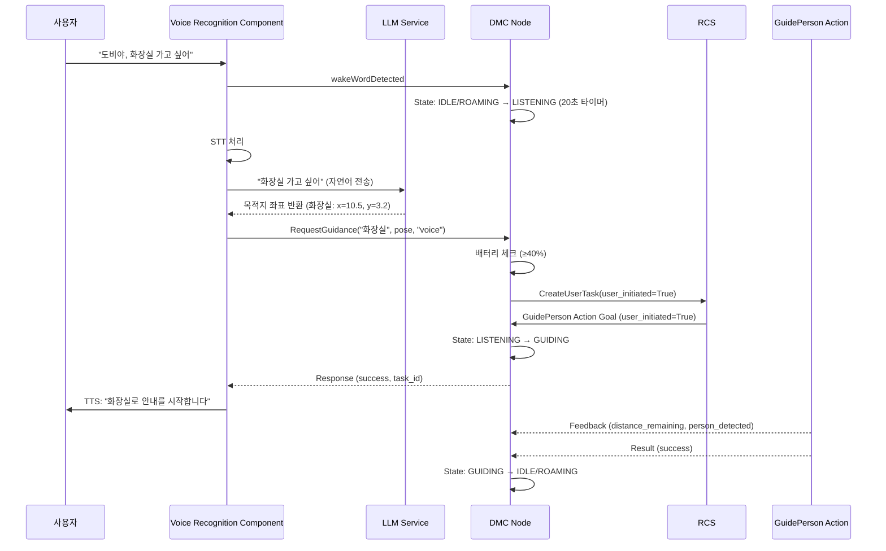

# VRC <-> DMC 통신 정리 문서

> 작성자: 김우영  
> 용도: VRC(Voice Recognition Component)와 DMC 간의 Service 인터페이스 정리  
> 대상: 도서관 로봇 Dobby  
> 작성일: 2025-01-27

---

## 📦 인터페이스 요약

| From | To   | Protocol | Interface 항목              | 메시지 형식                                  |
|------|------|----------|----------------------------|----------------------------------------------|
| VRC  | DMC  | Service  | 길안내 요청                 | `dobby1/admin/request_guidance`             |
| DMC  | VRC  | Topic    | 로봇 상태 발행              | `dobby1/status/robot_state`                 |

> **v4.0 변경사항**: `QueryLocationInfo` 서비스 제거  
> VRC는 LLM Service와 연동하여 좌표를 직접 획득하므로, DMC의 QueryLocationInfo를 호출하지 않습니다.

---

## 🔧 Service 정의

### 1. 길안내 요청 – `RequestGuidance.srv`

**용도**: 음성 명령 기반 길안내 시작

**Service Name**: `dobby1/admin/request_guidance`

**Message Definition**:
```srv
# Request
string destination_name              # 목적지 이름 (예: "화장실")
geometry_msgs/Pose2D dest_pose       # 목적지 좌표 (QueryLocationInfo로 받은 값)
string request_source                # 요청 출처: "gui" 또는 "voice"

---

# Response
bool success                         # 요청 성공 여부
string task_id                       # 생성된 작업 ID (예: "guidance_20250127_143022")
string message                       # 상태 메시지 (예: "길안내를 시작합니다", "로봇이 사용 중입니다")
```

**사용 시나리오 (v4.0 업데이트)**:
1. 사용자 "도비야, 화장실 가고 싶어" 음성 발화
2. **DMC 상태 전환**: IDLE/ROAMING → **LISTENING(10)** (VRC wakeWord 감지)
3. VRC가 STT 처리 → LLM Service에 전송
4. **LLM Service가 목적지 좌표 반환** (화장실: x=10.5, y=3.2)
5. VRC가 즉시 `RequestGuidance` 서비스 호출 (좌표 포함)
6. **DMC 내부 처리**:
   - 배터리 체크 (≥40%)
   - RCS에 CreateUserTask Service 호출 (user_initiated=True)
   - RCS로부터 task_id 수신
7. **DMC 상태 전환**: LISTENING(10) → **GUIDING(6)**
8. **RCS**: GuidePerson Action 호출 (goal.user_initiated=True)
9. DMC가 Action Goal 수락 및 길안내 시작
10. VRC에 Response 반환 (success=True, task_id)
11. VRC가 TTS 출력: "화장실로 안내를 시작합니다"

**전체 흐름**:
```
사용자 음성 → VRC (STT) → LLM Service (좌표 획득)
                              ↓
              VRC → RequestGuidance → DMC (LISTENING 상태)
                              ↓
                         배터리 체크
                              ↓
              DMC → CreateUserTask → RCS (user_initiated=True)
                              ↓
              RCS → GuidePerson Action → DMC
                              ↓
              DMC: LISTENING → GUIDING
```

> **v4.0 핵심 변경사항**: 
> - VRC는 DMC의 QueryLocationInfo를 호출하지 않음
> - LLM Service가 목적지 좌표를 직접 제공
> - DMC는 LISTENING 상태에서 RequestGuidance를 받음 (WAITING_DEST_INPUT 거치지 않음)
> - 음성 인식 자체가 명확한 의도 표현이므로 사용자 확인 절차 없음

**예시 호출**:
```python
# Request
destination_name: "출입구"
dest_pose:
  x: 2.0
  y: 1.5
  theta: 3.14
request_source: "voice"

# Response
success: True
task_id: "guidance_20250127_150322"
message: "출입구로 길안내를 시작합니다"
```

**에러 케이스**:
```python
# Case 1: 로봇이 이미 길안내 중
Response:
  success: False
  task_id: ""
  message: "로봇이 현재 다른 곳으로 안내 중입니다"

# Case 2: 위치를 찾을 수 없음
Response:
  success: False
  task_id: ""
  message: "해당 위치를 찾을 수 없습니다"

# Case 3: 충전 중
Response:
  success: False
  task_id: ""
  message: "로봇이 충전 중입니다. 잠시 후 다시 요청해주세요"
```

---

## 📡 Topic 구독

### 1. 로봇 상태 – `DobbyState.msg`

VRC는 로봇의 현재 상태를 확인하여 음성 명령 처리 가능 여부를 판단합니다.

**Topic Name**: `dobby1/status/robot_state`

**Message Definition**: `javis_interfaces/msg/DobbyState.msg` 참조

**주요 상태**:
- `IDLE(2)`: 대기 중 (음성 명령 수신 가능)
- `LISTENING(10)`: 음성 명령 대기 중 (VRC 활성화)
- `GUIDING(6)`: 길안내 수행 중 (새 명령 거부)
- `CHARGING(1)`: 충전 중 (명령 거부)

**VRC 사용 예시**:
```python
def can_accept_voice_command(self):
    current_state = self.robot_state.main_state
    return current_state in [2, 10]  # IDLE or LISTENING
```

---

## 🔄 전체 Workflow

### 음성 기반 길안내 흐름 (v4.0 업데이트)



> **v4.0 핵심 변경사항**:
> - QueryLocationInfo 제거: VRC는 LLM Service에서 좌표 획득
> - LISTENING 상태에서 RequestGuidance 직접 호출 (WAITING_DEST_INPUT 거치지 않음)
> - DMC → RCS CreateUserTask Service 호출 (user_initiated=True)
> - RCS가 상태 체크 없이 GuidePerson Action 호출

---

## 🎙️ 음성 명령 패턴

### 지원 명령어 형식

| 사용자 발화 예시                  | 추출 정보  | VRC → LLM 처리                              |
|----------------------------------|-----------|---------------------------------------------|
| "화장실로 안내해줘"               | 화장실 좌표 | LLM이 좌표 반환 → RequestGuidance 직접 호출 |
| "3층 가고 싶어"                   | 3층 좌표   | LLM이 좌표 반환 → RequestGuidance 직접 호출 |
| "카페 어디야?"                    | 카페 좌표   | LLM이 좌표 반환 → RequestGuidance 직접 호출 |

> **v4.0 변경**: VRC는 DMC의 QueryLocationInfo를 사용하지 않고, LLM Service에서 좌표를 직접 획득합니다.
| "카페 가는 길 알려줘"             | 카페        | QueryLocationInfo("카페") → RequestGuidance  |
| "출입구까지 데려다줘"             | 출입구      | QueryLocationInfo("출입구") → RequestGuidance |
| "안내데스크로 가자"               | 안내데스크  | QueryLocationInfo("안내데스크") → RequestGuidance |
| "열람실 어디야?"                  | 열람실      | QueryLocationInfo("열람실") → RequestGuidance |
| "도서 반납대 위치 알려줘"         | 반납대      | QueryLocationInfo("반납대") → RequestGuidance |

### 명령 처리 로직

```python
class VoiceRecognitionComponent:
    LOCATION_KEYWORDS = ["화장실", "카페", "출입구", "안내데스크", "열람실", "반납대"]
    GUIDANCE_TRIGGERS = ["안내", "가는 길", "데려다", "가자", "어디", "위치"]
    
    def process_voice_command(self, transcription):
        # 1. 목적지 키워드 추출
        destination = None
        for keyword in self.LOCATION_KEYWORDS:
            if keyword in transcription:
                destination = keyword
                break
        
        if not destination:
            self.tts("죄송합니다. 목적지를 이해하지 못했습니다")
            return
        
        # 2. 길안내 명령 확인
        is_guidance_request = any(trigger in transcription for trigger in self.GUIDANCE_TRIGGERS)
        if not is_guidance_request:
            self.tts(f"{destination}에 대해 무엇을 도와드릴까요?")
            return
        
        # 3. 위치 조회 (v4.0: 즉시 길안내 시작)
        location_response = self.query_location_info(destination)
        if not location_response.found:
            self.tts(f"{destination}의 위치를 찾을 수 없습니다")
            return
        
        # 4. 길안내 요청 (확인 절차 없이 즉시 호출)
        guidance_response = self.request_guidance(
            destination,
            location_response.pose,
            "voice"
        )
        
        if guidance_response.success:
            self.tts(f"{destination}로 안내를 시작합니다")  # "따라오세요" 제거 (피안내자 등록 단계에서 안내)
        else:
            self.tts(guidance_response.message)
```

---

## ⚙️ 네임스페이스 설정

- **로봇 네임스페이스**: `dobby1` (멀티 로봇 환경 대비)
- **Service 네임스페이스**: `admin` (관리자 인터페이스)
  - `dobby1/admin/query_location_info`
  - `dobby1/admin/request_guidance`
- **Topic 네임스페이스**: `status` (상태 정보)
  - `dobby1/status/robot_state`

---

## 📝 구현 참고사항

### DMC 측 구현 (GUI와 동일)

DMC는 요청 출처(`request_source`)에 관계없이 동일한 서비스 로직을 제공합니다.

```python
def _handle_request_guidance(self, request, response):
    # request_source가 "voice"인 경우
    if request.request_source == "voice":
        self.get_logger().info(f"음성 명령으로 길안내 요청: {request.destination_name}")
    
    # 동일한 처리 로직
    self.state_manager.set_main_state(MainState.GUIDING)
    goal = GuidePerson.Goal()
    goal.dest_location = request.dest_pose
    self.guide_action_client.send_goal_async(goal)
    
    response.success = True
    response.task_id = f"guidance_{datetime.now().strftime('%Y%m%d_%H%M%S')}"
    response.message = f"{request.destination_name}로 길안내를 시작합니다"
    return response
```

### VRC 측 구현 필요사항

1. **Service Client 생성**:
   ```python
   self.query_location_client = self.create_client(
       QueryLocationInfo,
       '/dobby1/admin/query_location_info'
   )
   
   self.request_guidance_client = self.create_client(
       RequestGuidance,
       '/dobby1/admin/request_guidance'
   )
   ```

2. **음성 명령 처리 파이프라인**:
   ```python
   def on_voice_transcription(self, text):
       # 1. 키워드 추출
       destination = self.extract_destination(text)
       if not destination:
           return
       
       # 2. 위치 조회
       query_req = QueryLocationInfo.Request()
       query_req.location_name = destination
       query_future = self.query_location_client.call_async(query_req)
       query_future.add_done_callback(lambda f: self.on_location_found(f, destination))
   
   def on_location_found(self, future, destination):
       query_resp = future.result()
       if not query_resp.found:
           self.tts(f"{destination}의 위치를 찾을 수 없습니다")
           return
       
       # 3. 길안내 요청
       guidance_req = RequestGuidance.Request()
       guidance_req.destination_name = destination
       guidance_req.dest_pose = query_resp.pose
       guidance_req.request_source = "voice"
       
       guidance_future = self.request_guidance_client.call_async(guidance_req)
       guidance_future.add_done_callback(self.on_guidance_started)
   ```

3. **TTS 응답 생성**:
   ```python
   def on_guidance_started(self, future):
       resp = future.result()
       if resp.success:
           self.tts(f"{resp.message}. 따라오세요")
       else:
           self.tts(resp.message)
   ```

---

## 🧪 테스트 체크리스트

- [ ] QueryLocationInfo: 모든 시설 이름 조회 성공
- [ ] QueryLocationInfo: 별칭으로 조회 성공 (예: "toilet" → "화장실")
- [ ] QueryLocationInfo: 잘못된 이름 → `found=False` 반환
- [ ] RequestGuidance: LISTENING 상태에서 요청 성공
- [ ] RequestGuidance: GUIDING 상태에서 요청 → `success=False` 반환
- [ ] RequestGuidance: `request_source="voice"` 로깅 확인
- [ ] 음성 명령 → 위치 조회 → 길안내 → TTS 응답 전체 흐름
- [ ] 동시 음성 명령 처리 (큐잉 또는 거부)
- [ ] 길안내 중 새 음성 명령 → 거부 응답

---

## 🚨 에러 처리 가이드

### VRC 측 에러 핸들링

```python
def handle_guidance_errors(self, response):
    error_messages = {
        "로봇이 현재 다른 작업을 수행 중입니다": "죄송합니다. 로봇이 다른 작업을 하고 있습니다. 잠시 후 다시 요청해주세요",
        "배터리가 부족하여 길안내를 시작할 수 없습니다": "배터리가 부족합니다. 충전 후 다시 이용해주세요",
        "유효하지 않은 목적지 좌표입니다": "목적지 정보가 올바르지 않습니다. 다시 말씀해주세요"
    }
    
    if not response.success:
        for error_key, tts_message in error_messages.items():
            if error_key in response.message:
                self.tts(tts_message)
                return
        
        # 기본 에러 메시지
        self.tts("죄송합니다. 길안내를 시작할 수 없습니다")
```

---

## 📚 참고 문서

- `GuidanceFlowRefactor.md`: 새로운 길안내 흐름 상세 설계
- `DevelopmentPlan.md`: DMC 전체 아키텍처 및 상태 정의
- `gui_to_dmc.md`: GUI 기반 길안내 인터페이스 (동일 서비스 사용)
- `library_locations.yaml`: 도서관 시설 좌표 데이터

---

## 🔗 관련 컴포넌트

- **VRC (Voice Recognition Component)**: 음성 인식 및 TTS 담당
- **DMC (Dobby Main Controller)**: 로봇 메인 제어 및 상태 관리
- **NAV (Navigation)**: GuidePerson Action 실행
